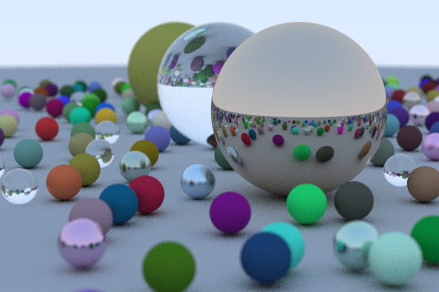

RayTracer
===

A ray tracer in rust. Based on Peter Shirley's Ray Tracing in One Weekend.

## Changelog

### September 21, 2017 | 1

I posted the link to this repo on [/r/rust](https://www.reddit.com/r/rust/comments/71jp12/my_hello_world_in_rust_a_simple_raytracer_uses/) and folks suggested that I run in release mode (I was running in debug mode the whole time). This significantly improved the runtime. 

There's also a progressbar while rendering/saving now, thanks to [coder543](https://github.com/coder543)'s [Pull Request](https://github.com/ranveeraggarwal/rust-raytracer/pull/1).

A 480x320 image at 1000 samples took around 23 minutes to render.

PS: Hence proved. Rust has an awesome community.

### September 21, 2017 | 0

Multi-threaded implementation using Rayon. 480x320 image at 100 samples took around 46 minutes to render.

### September 10, 2017

Single-threaded implementation complete. 1200x800 image at 10 samples took nearly 6 hours to render.

## Status

Image generated after running 504 random spheres at 1000 samples.    
CPU: Intel Xeon E5-1650 v2: 6 cores/12 threads.

